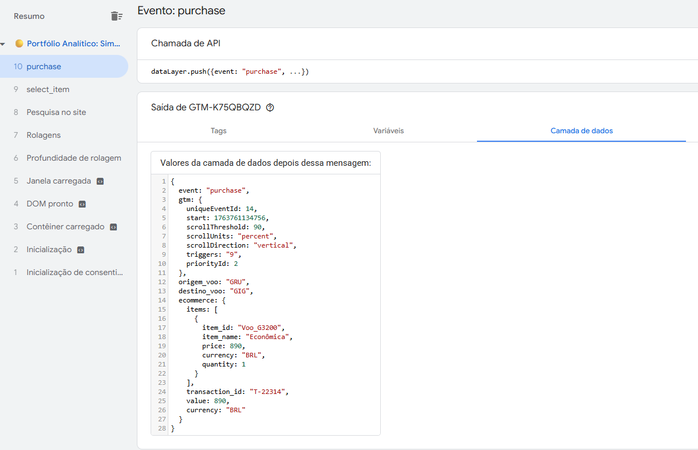

# 🚀 Projeto Sandbox: Implementação de Funil Web GTM/GA4

Olá! Este repositório hospeda um ambiente de teste (Sandbox) de alto nível para demonstrar habilidades em **Web Analytics Implementation** e **Gerenciamento de Tags**.

O objetivo primário deste projeto é simular uma jornada de compra complexa (Funil Web) e rastrear cada etapa utilizando o **Google Tag Manager (GTM)**, com o envio dos dados para o **Google Analytics 4 (GA4)**.

---

## 🎯 Habilidades Técnicas Demonstradas

Este ambiente foi construído para solucionar o desafio de implementar tagueamento em um contexto real, garantindo a execução correta do código.

| Categoria | Conceito | Demonstração |
| :--- | :--- | :--- |
| **Implementação** | **Injeção GTM Segura** | GTM injetado corretamente na tag `<head>` (resolvendo o problema de ambientes de teste). |
| **DataLayer** | **Eventos Personalizados** | Uso do `dataLayer.push` para enviar eventos e parâmetros customizados (ex: `origem_voo`, `transaction_id`). |
| **GA4** | **Enhanced E-commerce** | Simulação de eventos padrão de e-commerce do GA4 (ex: `select_item`, `begin_checkout`, `purchase`). |
| **Arquitetura** | **Single Page Application (SPA)** | Simulação de navegação sequencial sem recarregar a página (via JavaScript), testando o histórico de alterações do GTM. |
| **Hosting** | **GitHub Pages** | Utilização de ambiente `https://` para garantir compatibilidade com o Preview Mode do GTM. |

---

## ✈️ O Funil Simulado (Demonstração ao Vivo)

A página principal (`index.html`) simula a experiência de um site de reserva de passagens aéreas. Cada clique no funil dispara um evento crucial:

| Etapa | Ação no Site | Evento DataLayer Disparado | Propósito Analítico |
| :--- | :--- | :--- | :--- |
| **1.** | Pesquisa de Voos | `view_search_results` | Entender a intenção do usuário (Origem/Destino). |
| **2.** | Seleção de Voo | `select_item` | Rastreamento de qual item foi escolhido antes do carrinho. |
| **3.** | Início do Checkout | `begin_checkout` | Início do funil de conversão (momento crítico de abandono). |
| **4.** | Compra Final | `purchase` | Conversão final e registro de receita (Transação ID e Valor). |

**🔗 Teste o Funil Agora:** [Insira Aqui a URL do seu GitHub Pages, ex: `https://rermartins.github.io/meu-sandbox/`]

---

## 🖼️ Showcase de Análises & Insights

Esta seção será atualizada com as análises geradas a partir dos dados coletados deste Sandbox.

### A. Validação de Disparo de Tags (Tag Assistant)

* **Objetivo:** Provar que o GTM está capturando todos os eventos personalizados corretamente.

### B. Relatório de Conversão no GA4

* **Objetivo:** Mostrar que a Tag de `purchase` está sendo corretamente registrada como uma conversão de receita no Google Analytics 4.

### C. Funil de Visualização

* **Objetivo:** Exibir a visualização de funil construída no GA4 a partir dos eventos simulados, identificando as taxas de abandono entre as etapas.

